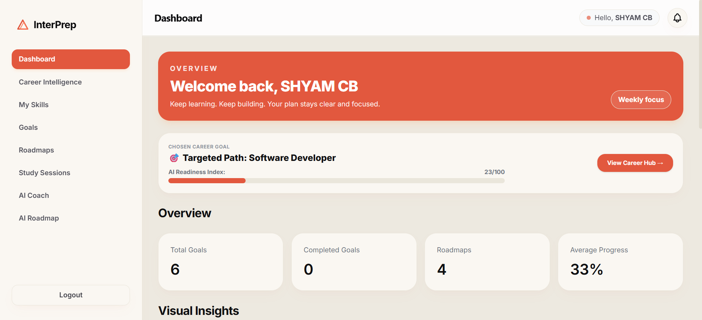
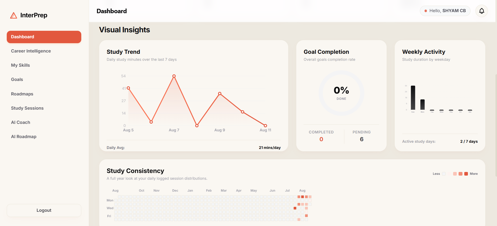
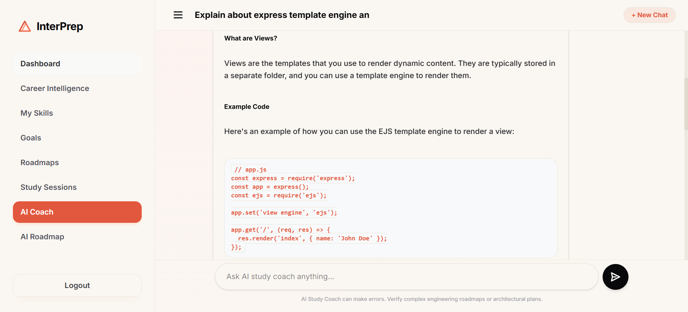
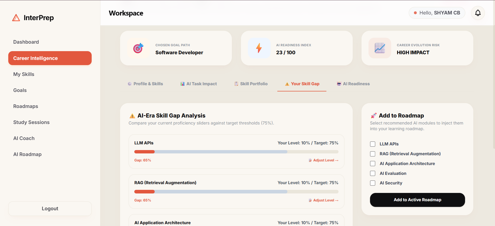
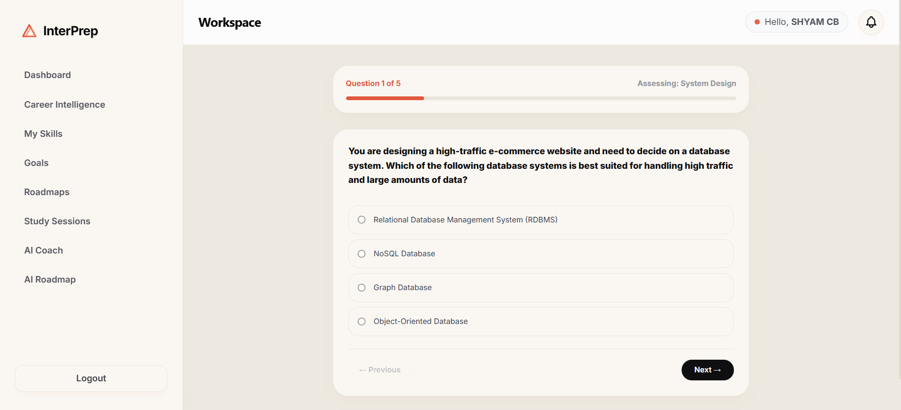
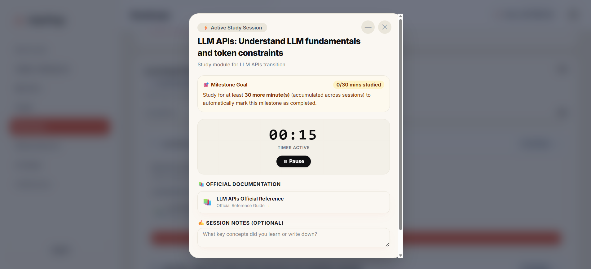

# InterPrep

> **A career-aware learning and interview preparation platform that helps students understand how their chosen career is evolving, identify skill gaps, and turn those insights into an actionable learning roadmap.**

InterPrep is a full-stack MERN application designed to go beyond traditional goal-tracking and learning-management platforms.

Instead of only asking **"What do I want to learn?"**, InterPrep also asks:

> **"How is my target career changing, how does that affect my current skills, and what should I learn next to stay relevant?"**

---

## 🚀 Why InterPrep?

Students often learn from static roadmaps while the technology industry changes continuously.

For example, a student preparing for **Software Development** may already know HTML, CSS, JavaScript, React, Node.js and databases. However, modern software development increasingly involves AI-assisted development, LLM APIs, RAG, AI application architecture, evaluation, security and responsible AI practices.

The problem is not simply a lack of learning resources.

The problem is **knowing what matters now and what to prioritize next**.

InterPrep addresses this by connecting:

```text
Career Evolution
       ↓
Technology / Skill Impact
       ↓
Current Skill Assessment
       ↓
Skill Gap Analysis
       ↓
Learning Recommendations
       ↓
Personal Roadmap
       ↓
Study Sessions
       ↓
Progress & Analytics
```

---

## ✨ Core Features

### 🎯 Personalized Learning Goals

Create and manage learning goals with progress tracking.

- Create goals
- Track progress
- Update goal status
- Search and filter goals
- Monitor completion

### 🗺️ Learning Roadmaps

Build structured learning paths instead of studying randomly.

- Create roadmaps
- Add learning steps
- Track step completion
- Calculate roadmap progress
- Connect emerging skills to active roadmaps

### 📚 Study Sessions

Turn learning plans into measurable study activity.

- Start focused study sessions
- Built-in study timer
- Track study duration
- Add session notes
- Track milestone-based learning
- Record study history

### 📊 Learning Analytics

Understand learning behaviour through visual analytics.

- Study trends
- Goal completion
- Weekly study activity
- Study consistency
- Year-long activity heatmap
- Average study time

### 🧠 Career Intelligence

**The core differentiating feature of InterPrep.**

Career Intelligence connects a student's chosen career with changing technology requirements.

For a selected career, InterPrep can help analyze:

- How AI is affecting the career
- Which tasks are being changed by AI
- Which skills are becoming more important
- Current skill proficiency
- Target proficiency
- Skill gaps
- AI-readiness
- Recommended learning modules

For example:

```text
Target Career
    ↓
Software Developer
    ↓
AI Impact
    ↓
Emerging Skills
    ├── LLM APIs
    ├── RAG
    ├── AI Application Architecture
    ├── AI Evaluation
    └── AI Security
    ↓
Compare with student's current skills
    ↓
Identify skill gaps
    ↓
Recommend what to learn
    ↓
Add selected modules to roadmap
```

### 🧩 Skill Gap Analysis

InterPrep compares the student's current proficiency against target thresholds.

Example:

```text
LLM APIs

Current Level: 10%
Target Level: 75%

Skill Gap: 65%
```

This turns career information into a concrete learning decision.

### ⚡ AI Readiness Index

InterPrep provides an application-level readiness indicator based on the student's skills and learning progress.

The score is intended as an **InterPrep learning indicator**, not as an industry-certified measurement.

### 📝 Skill Assessment

Students can assess their knowledge through structured questions.

Assessment results can be used to better understand current proficiency and identify areas requiring improvement.

### 🤖 AI-Assisted Learning

InterPrep includes AI-oriented learning functionality such as AI coaching and AI roadmap generation to help students turn learning objectives into practical study plans.

---

## 🖥️ Application Screenshots

### Dashboard

The dashboard gives students a single view of their career target, AI readiness, goals, roadmaps, progress and learning analytics.



### Learning Analytics

Visualize study trends, goal completion, weekly activity and long-term study consistency.



### Personalized AI coach

AI Coach acts as an interactive learning companion, helping students understand concepts rather than simply providing answers.



### Career Intelligence — Skill Gap Analysis

Career Intelligence identifies emerging AI-related skills and compares them against the student's current proficiency.



### Skill Assessment

Assess technical knowledge through structured questions.



### Focused Study Session

Study modules with a focused timer, milestone tracking, official documentation and session notes.



> **Screenshot setup:** Place the uploaded screenshots in `docs/screenshots/` using the filenames shown above.

---

## 🏗️ System Overview

```text
┌──────────────────────────────────────────────────────┐
│                    INTERPREP                         │
├──────────────────────────────────────────────────────┤
│                                                      │
│  Authentication                                      │
│       │                                              │
│       ▼                                              │
│  Student Profile                                     │
│       │                                              │
│  ┌────┼─────────────┬───────────────┐                │
│  ▼    ▼             ▼               ▼                │
│Goals Roadmaps  Study Sessions   Career Intelligence  │
│  │    │             │               │                │
│  └────┼─────────────┴───────────────┘                │
│       ▼                                              │
│    Analytics                                         │
│       │                                              │
│       ▼                                              │
│  Personalized Learning Progress                     │
│                                                      │
└──────────────────────────────────────────────────────┘
```

---

## 🧠 Career Intelligence Flow

The key product workflow is:

```text
1. Student selects a career
             ↓
2. InterPrep analyzes career/AI impact
             ↓
3. Emerging skills are identified
             ↓
4. Student's current skills are evaluated
             ↓
5. Current vs target proficiency is compared
             ↓
6. Skill gaps are calculated
             ↓
7. Priority learning areas are identified
             ↓
8. Student adds relevant modules to roadmap
             ↓
9. Student studies and records sessions
             ↓
10. Progress contributes to the student's
    learning/readiness picture
```

This creates a feedback loop between **career intelligence and actual learning activity**.

---

## 🛠️ Tech Stack

### Frontend

- React
- Vite
- Tailwind CSS
- Redux Toolkit
- React Redux
- React Router
- Reusable component architecture
- Data visualization / analytics components

### Backend

- Node.js
- Express.js
- MongoDB
- Mongoose
- JWT Authentication
- bcryptjs
- REST APIs
- Middleware-based architecture

### AI / Intelligence Layer

- AI-assisted career analysis
- AI-oriented learning recommendations
- AI roadmap generation
- AI coaching functionality

### Development Tools

- Git
- GitHub
- MongoDB Atlas
- MongoDB Compass
- Postman
- Figma

---

## 🔐 Authentication & Security

InterPrep uses JWT-based authentication with protected API routes.

Security-related implementation includes:

- User registration
- Login authentication
- JWT access tokens
- Protected routes
- Ownership checks
- Password hashing with bcrypt
- Environment variables for sensitive configuration
- Centralized error handling

---

## 📁 Project Architecture

A simplified architecture:

```text
InterPrep/
│
├── client/
│   ├── src/
│   │   ├── components/
│   │   ├── pages/
│   │   ├── features/
│   │   ├── store/
│   │   ├── services/
│   │   ├── context/
│   │   └── utils/
│   │
│   └── ...
│
├── server/
│   ├── controllers/
│   ├── models/
│   ├── routes/
│   ├── middleware/
│   ├── utils/
│   └── ...
│
├── docs/
│   ├── PRD.md
│   ├── SYSTEM_DESIGN.md
│   ├── API_DATABASE_DESIGN.md
│   └── screenshots/
│
└── README.md
```

> The exact folder structure may vary depending on the current implementation.

---

## 🗄️ Main Data Models

The backend is designed around several core entities:

```text
User
 │
 ├── Goals
 │
 ├── Roadmaps
 │      └── Roadmap Steps
 │
 ├── Study Sessions
 │
 ├── Skills
 │
 ├── Career Profile
 │
 └── Career Intelligence / Readiness Data
```

This allows learning activity, career information and skill development to be connected instead of being treated as isolated features.

---

## 🔌 API Architecture

The backend follows a RESTful API architecture.

Typical resource groups include:

```text
/api/auth
/api/goals
/api/roadmaps
/api/study-sessions
/api/dashboard
/api/skills
/api/career-intelligence
```

Protected resources use JWT authentication and ownership validation.

---

## ⚙️ Getting Started

### Prerequisites

Make sure you have:

- Node.js
- npm
- MongoDB Atlas account or MongoDB instance
- Required AI API credentials for enabled AI features

### 1. Clone the repository

```bash
git clone <your-repository-url>
cd interprep
```

### 2. Install dependencies

Install frontend dependencies:

```bash
cd client
npm install
```

Install backend dependencies:

```bash
cd ../server
npm install
```

### 3. Configure environment variables

Create the required `.env` files.

Example backend configuration:

```env
PORT=5000
MONGO_URI=your_mongodb_connection_string
JWT_SECRET=your_jwt_secret
JWT_EXPIRES_IN=90d
```

Add the AI provider/API variables required by the current implementation.

**Never commit real API keys or secrets to GitHub.**

### 4. Start the backend

```bash
cd server
npm run dev
```

### 5. Start the frontend

```bash
cd client
npm run dev
```

Open the local Vite URL shown in the terminal.

---

## 🎯 Example User Journey

A typical InterPrep workflow looks like this:

### Step 1 — Choose a career

```text
Software Developer
```

### Step 2 — Understand career evolution

Career Intelligence highlights how AI is changing software development.

### Step 3 — Review skill gaps

The student sees areas such as:

```text
LLM APIs                  10% → 75%
RAG                       10% → 75%
AI Application Architecture
AI Evaluation
AI Security
```

### Step 4 — Choose what to learn

The student selects relevant modules.

### Step 5 — Add them to the roadmap

The selected modules become actionable roadmap items.

### Step 6 — Study

The student starts focused study sessions and records learning time.

### Step 7 — Track progress

Dashboard analytics show whether the student is consistently progressing.

---

## 🌟 What Makes InterPrep Different?

InterPrep is **not designed to compete with YouTube or traditional course platforms**.

It focuses on a different problem:

> **Learning direction in a rapidly changing technology landscape.**

Traditional learning platforms primarily answer:

> "Here is content you can learn."

InterPrep aims to answer:

> "Given the career you want, how is that career changing, what skills matter more now, where are you currently behind, and what should you learn next?"

That distinction is the central idea behind **Career Intelligence**.

---

## 🎓 Project Relevance

InterPrep demonstrates several areas of modern software engineering:

- Full-stack web development
- REST API design
- Authentication and authorization
- Database modeling
- State management
- Data visualization
- Personalized recommendation logic
- AI integration
- Skill-gap analysis
- Career intelligence
- Analytics
- Responsive UI/UX
- Modular software architecture

The project addresses a real-world problem faced by students and early-career developers:

> **How can learners continuously adapt their learning plans as technology and industry expectations change?**

---

## 🔮 Future Improvements

Potential future improvements include:

- More career domains
- Real-time industry trend ingestion
- Evidence-based skill verification
- Project-based skill assessment
- More advanced recommendation models
- Job-description skill analysis
- Learning-resource recommendations
- Career intelligence history and trend tracking
- Improved AI evaluation
- More detailed readiness scoring

---

## 📌 Project Status

**Status: Active development / Final-year project**

Core learning, roadmap, study tracking, analytics and Career Intelligence functionality have been implemented.

The current focus is on improving:

- Reliability
- UX polish
- Explainability
- Testing
- Documentation
- Deployment readiness

---

## 👨‍💻 Author

**Shyam C B**

Computer Science & Engineering

---

## 📄 License

This project is currently intended primarily as an academic and portfolio project.

Add an appropriate open-source license if you decide to distribute the source code publicly.
